# 100 Days Of Code - Log

### Day 0: January 21, 2022

**Today's Progress**: Found a neat React course by [The Net Ninja](https://www.youtube.com/c/TheNetNinja). Then did my first Frontend Mentor challenge.

**Thoughts:** Frontend Mentor is amazing. It's like Codewars but for frontend stuff. The first challenge I completed was very basic, so I really hope I didn't mess it up 😅.

**Link to work:** [QR code page component (block)](https://www.frontendmentor.io/solutions/qr-code-page-component-block-p8k1LY9cM)

### Day 1: January 22, 2022

**Today's Progress**: Created my first React app. Learned about dynamic values and used it to create a paragraph that generates a random number using {Math.floor(Math.random() \* 10)}.

**Thoughts**: I can already see why React is very powerful. The ability to combine JavaScript logic with frontend tools unlocks a lot of possibilities (imagine a Tesla UI but in a web browser!).

**Link(s) to work**: 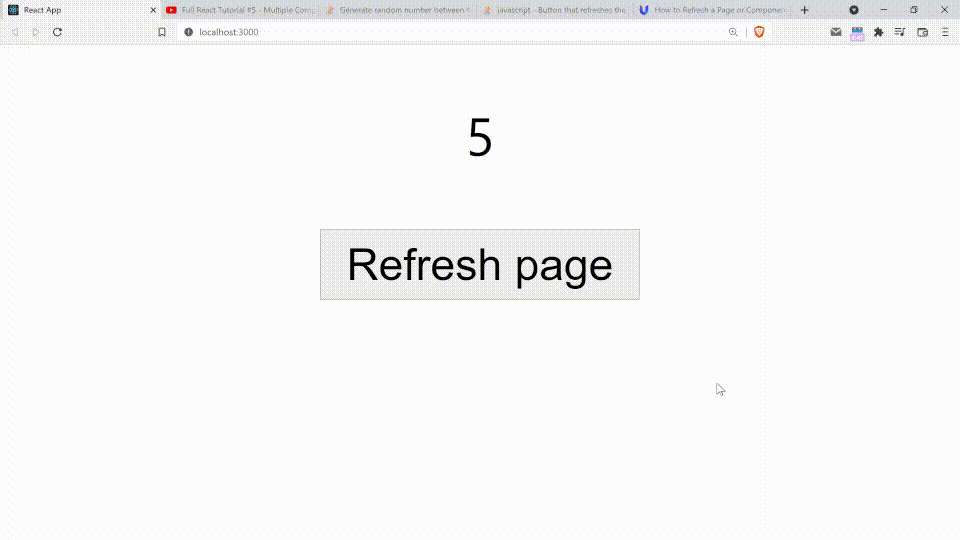

### Day 2: January 23, 2022

**Today's Progress**: Learned about React components, click events, props, and useState hooks. Used my knowledge to create a click counter (demo below).

**Thoughts**: React is starting to come together for me. My first basic app has shown me first-hand why React is very powerful. Also, I'm starting to think that React is actually rather fun - I thought that it'd be less fun than Svelte but I guess I was wrong.

**Link(s) to work**: 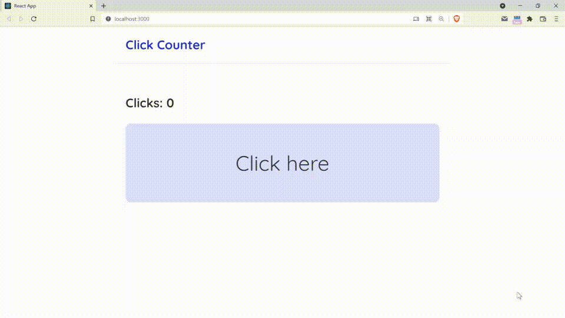

### Day 3: January 24, 2022

**Today's Progress**: Learned how to output a list in React.

**Thoughts**: It's not as fancy as Svelte but it gets the job done. It also feels more native (Svelte uses some crazy syntax to output lists). React is becoming very fun.

**Work(s)**: 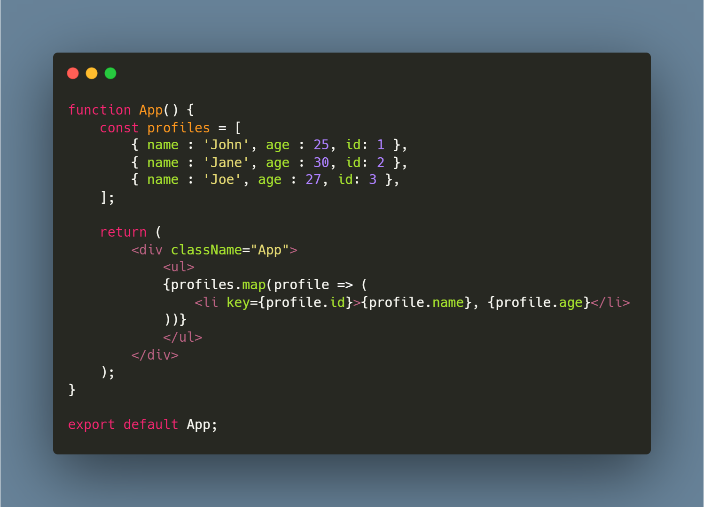

### Day 4: January 25, 2022

**Today's Progress**: Learned how to use functions and props.

**Thoughts**: Using props as functions is important because sometimes you want the component to be able to manipulate the data it receives. For that, you would need to create the event handler outside of the component and pass the function as a prop so that it can be access within the component.

**Work(s)**: 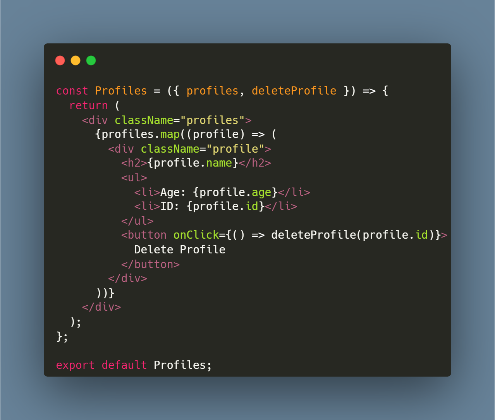

### Day 5: January 31, 2022

**Today's Progress**: Learned about the useEffect hook

**Thoughts**: TBH I still don't know the use cases for this hook. After all I haven't worked with the backend before. Also, I had to take a break but not for this long! Will try not to do it again.

### Day 6: February 4, 2022

**Today's Progress**: Learned about TailwindCSS basics.

**Thoughts**: Tailwind is streamlined. There are a pre-defined set of choices for each style so I wouldn't need to tinker around too much. I'm curious to how responsive design will work, however.

**Work(s)**: 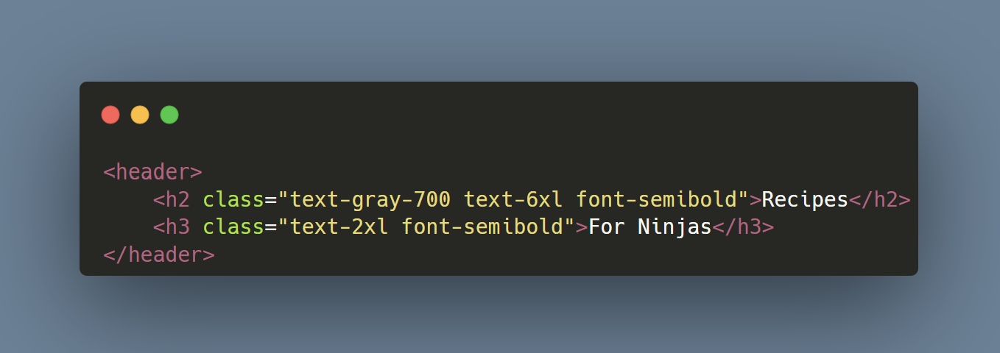

### Day 7: February 9, 2022

**Today's Progress**: Read through the TailwindCSS docs.

**Thoughts**: I don't think I can use TailwindCSS without reading the docs. There are so many things to remember! Also, it has been a rough few weeks - I haven't been able to code consistently. However, I want to begin prioritizing #100DaysOfCode because learning how to code will unlock me many opportunities.

**Work(s)**: 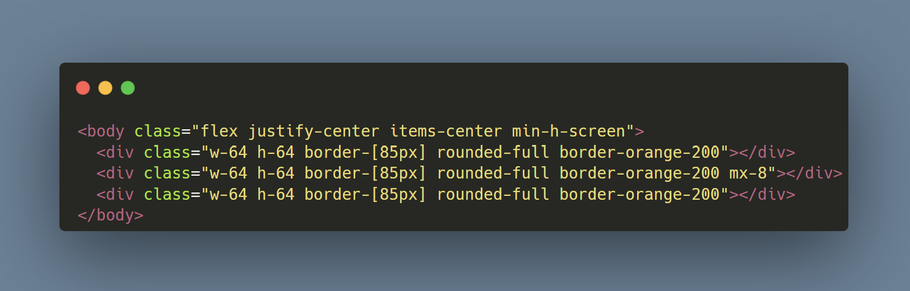

### Day 8: February 11, 2022

**Today's Progress**: Made an NFT card component using TailwindCSS as a Frontend Mentor challenge.

**Thoughts**: I'm far from a Tailwind master, but I can already feel like I can style faster. This just goes to show how rapid TailwindCSS is!

**Work(s)**: 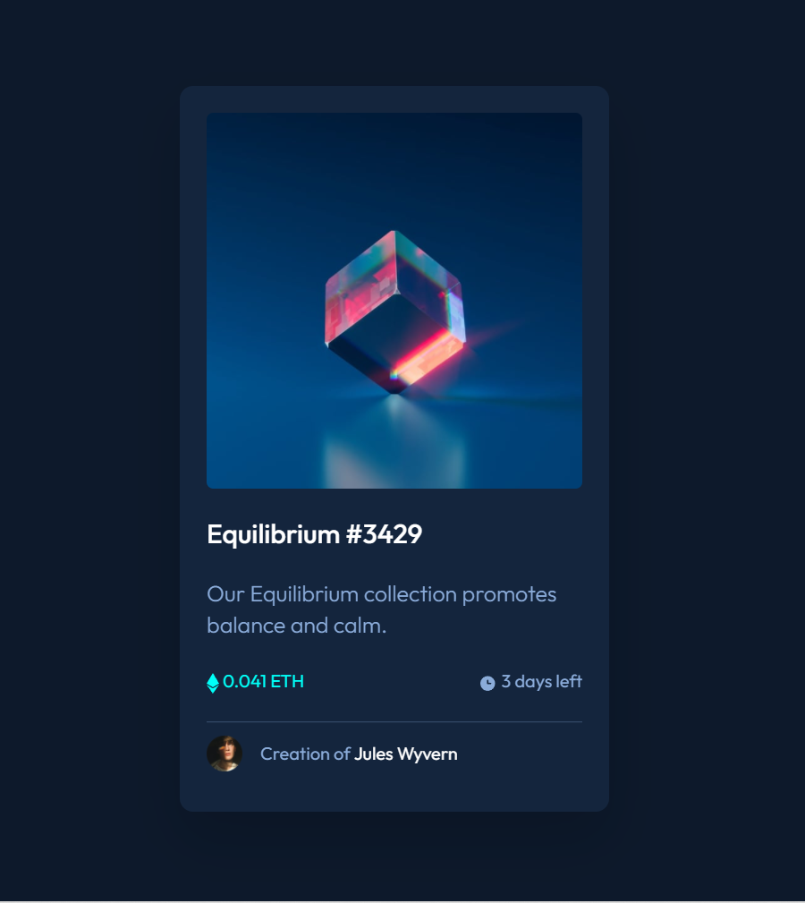

### Day 9: February 12, 2022

**Today's Progress**: Worked on a new Discord bot.

**Thoughts**: I feel like the technologies I have been learning (Parcel, TypeScript, etc.). They help me manage my project but they are also very difficult to set up.

### Day 10: February 13, 2022

**Today's Progress**: Back to React! I learned how to fetch data using the useEffect hook. I then made a useFetch hook that can also handle fetch errors!

**Thoughts**: I now know why useEffect is an important hook! Fetching data from servers is a lot more complicated than I imagined.

**Work(s)**: 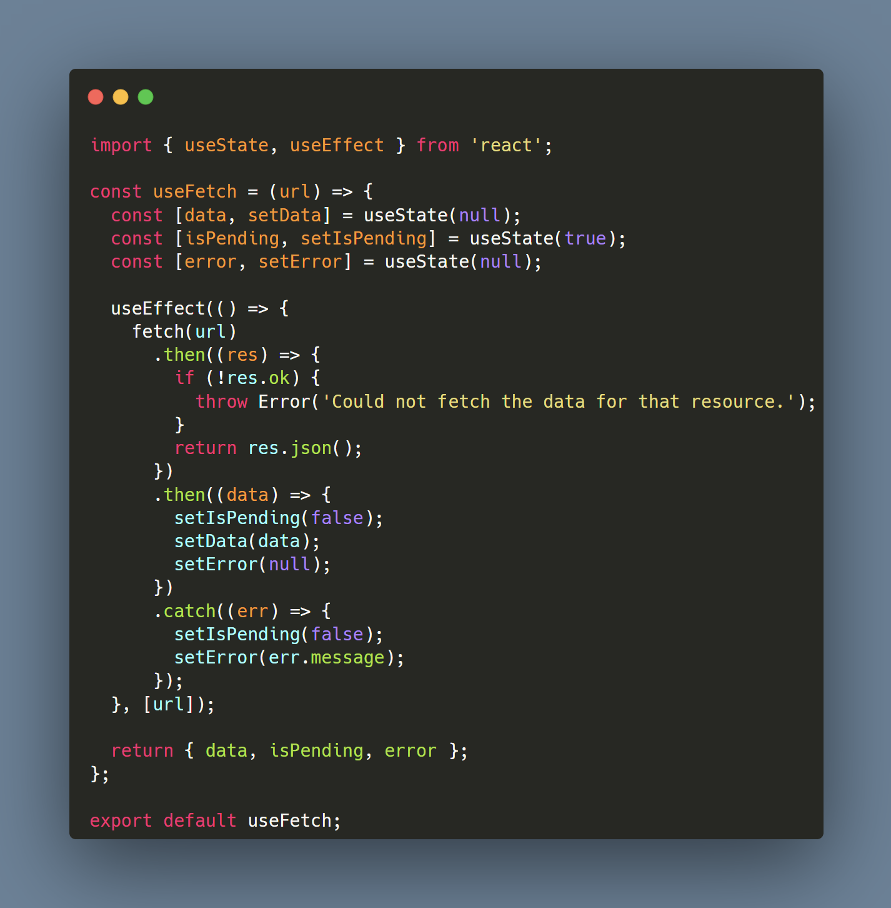

### Day 11: February 14, 2022

**Today's Progress**: I learned how to use the react-router-dom to make websites multi-page.

**Thoughts**: I think making multiple pages in React is much more elegant than making multiple HTML pages.

**Work(s)**: 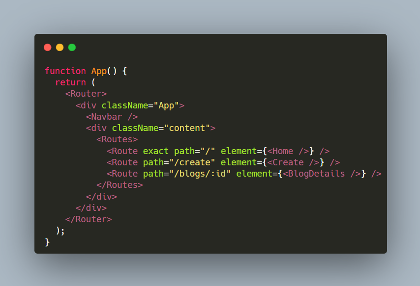

### Day 12: February 20, 2022

**Today's Progress**: I learned about React route parameters, controlled inputs/forms, submit events, redirects, and 404 pages.

**Thoughts**: I think I'm ready enough to create my own websites using React. I'm very excited.

### Day 13: March 6, 2022

**Today's Progress**: I worked on a Frontend Mentor component using TailwindCSS. I still need to implement responsive design and implement hover states.

**Thoughts**: I want to practice my frontend styling skills.

**Work(s)**: 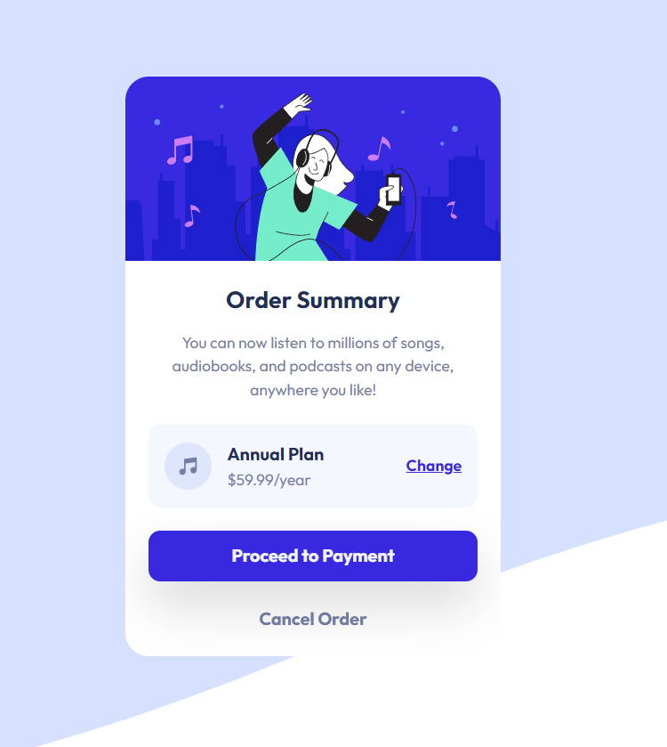

### Day 14: March 7, 2022

**Today's Progress**: I completed the Frontend Mentor component I've been working on. Made with TailwindCSS.

**Thoughts**: I think great planning will allow me to practice my front-end skills well.

**Work(s)**: 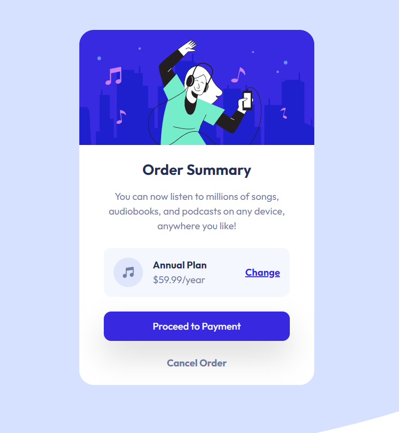

### Day 15: March 19, 2022

**Today's Progress**: I began working on my first personal project: a Valorant map picker website!

**Thoughts**: Working without holding someone's hand (like in a tutorial) is a LOT harder. There are so many more roadblocks!

### Day 16-22: March 21-25, 28-30, 2022

**Today's Progress**: I continued working on my Valorant map picker. However, I got stuck with asset management - I couldn't get background images to show conditionally for some reason.

**Thoughts**: The asset management issue could've been because of Parcel. I might as well learn Webpack at this point.

### Day 23: March 31, 2022

**Today's Progress**: Learned Webpack 5 using Traversy Media's Webpack 5 Crash Course.

**Thoughts**: Back then I was intimidated by the amount of configuration needed for Webpack. However, it doesn't seem too bad now -- probably cause Traversy broke down the concepts well.

### Day 24: April 3, 2022

**Today's Progress**: I changed my Valorant map picker project to use create-react-app - I finally fixed the asset management bug!

**Thoughts**: I avoided create-react-app because I didn't want to mess with Webpack - oh how silly I was 😅.

### Day 25: April 4, 2022

**Today's Progress**: I worked on my Valorant map picker project. I worked on a conditional filler cell for my responsive design.

**Thoughts**: It was a little tricky but React + TailwindCSS made implementing this easy.

**Work(s)**: 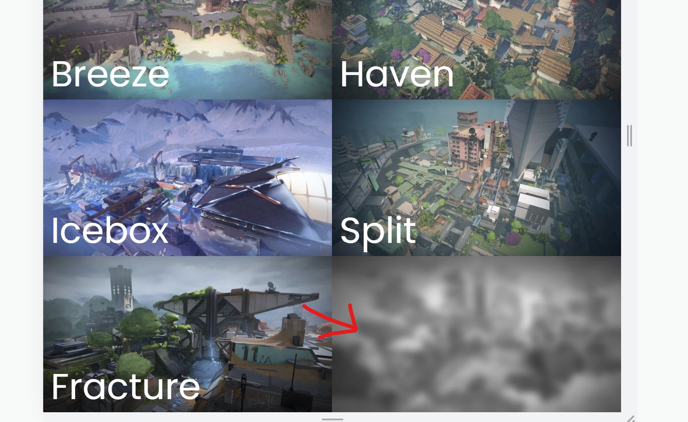

### Day 26: April 5, 2022

**Today's Progress**: I finished my Valorant map picker project! It's responsive and complete with animations.

**Thoughts**: Honestly my first React web app is still rather basic but you've got to start somewhere so 🤷‍♂️😆.

**Work(s)**: 

### Day 27: April 12, 2022

**Today's Progress**: Began working on an interactive component for a Frontend Mentor challenge. Finished project setup + rough layout so far.

**Thoughts**: I have the sudden urge to grind Frontend Mentor. It should be great for practicing my front-end skills.

**Work(s)**: 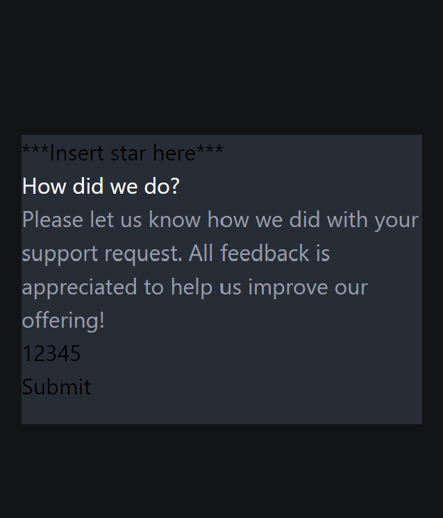

### Day 28: April 24, 2022

**Today's Progress**: Learned VueJS fundamentals and began creating a task tracker app to apply the things I learned.

**Thoughts**: I hate jumping around and learning different things all the time - but VueJS seems genuinely fun, fast, and reliable.

### Day 29: April 25, 2022

**Today's Progress**: Completed the task tracker app that I was working on using VueJS.

**Thoughts**: I think Vue does a lot of things better than React - but I'm still unsure about how scalable it is in comparison. I will continue using it though!

**Work(s)**: https://pixelzee-vue-task-tracker.netlify.app/

### Day 30: April 26, 2022

**Today's Progress**: Began working on a personal project of mine: a Tesla Model 3/Y UI simulator! I worked on the UI layout.

**Thoughts**: I think projects like these will truly test my skills. There will be - and there has already been - roadblocks throughout the project. However, I think the tools I have with me will help me overcome them.

**Work(s)**: https://github.com/pixelzee3/tesla-model-3y-ui

### Day 31: April 28, 2022

**Today's Progress**: Completed the design for the base state of a Frontend Mentor component.

**Thoughts**: Frankly, this type of work is getting a little boring. I think I'm going to go a little wild while I have time.

**Work(s)**: 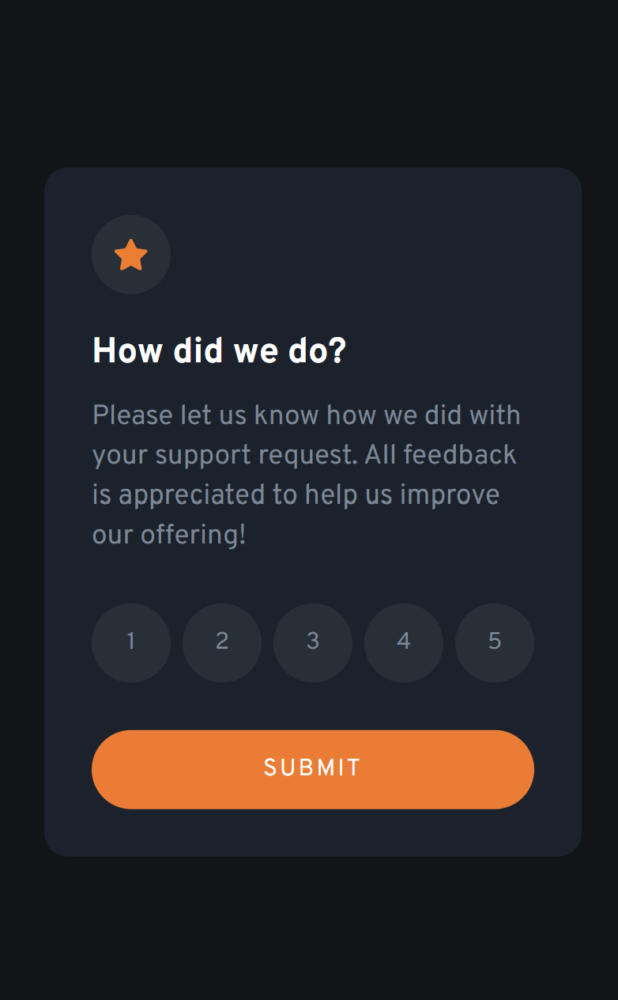

### Day 32: April 29, 2022

**Today's Progress**: Finished making an Interactive Rating Component for a Frontend Mentor challenge.

**Thoughts**: I had to solve some cryptic bugs to implement the interactive functions but it was generally fun (adverse to what I said yesterday, apparently 😂).

**Work(s)**:
[Repo link](https://github.com/pixelzee3/interactive-rating-component-main), [preview link](https://pixelzee-interactive-rating-component-main.netlify.app/)

### Day 33: May 6, 2022

**Today's Progress**: Tried to work on an old Discord bot I was working on. 

**Thoughts**: The breaking changes in my module bundlers really threw me off - the development experience wasn't nice 😔.